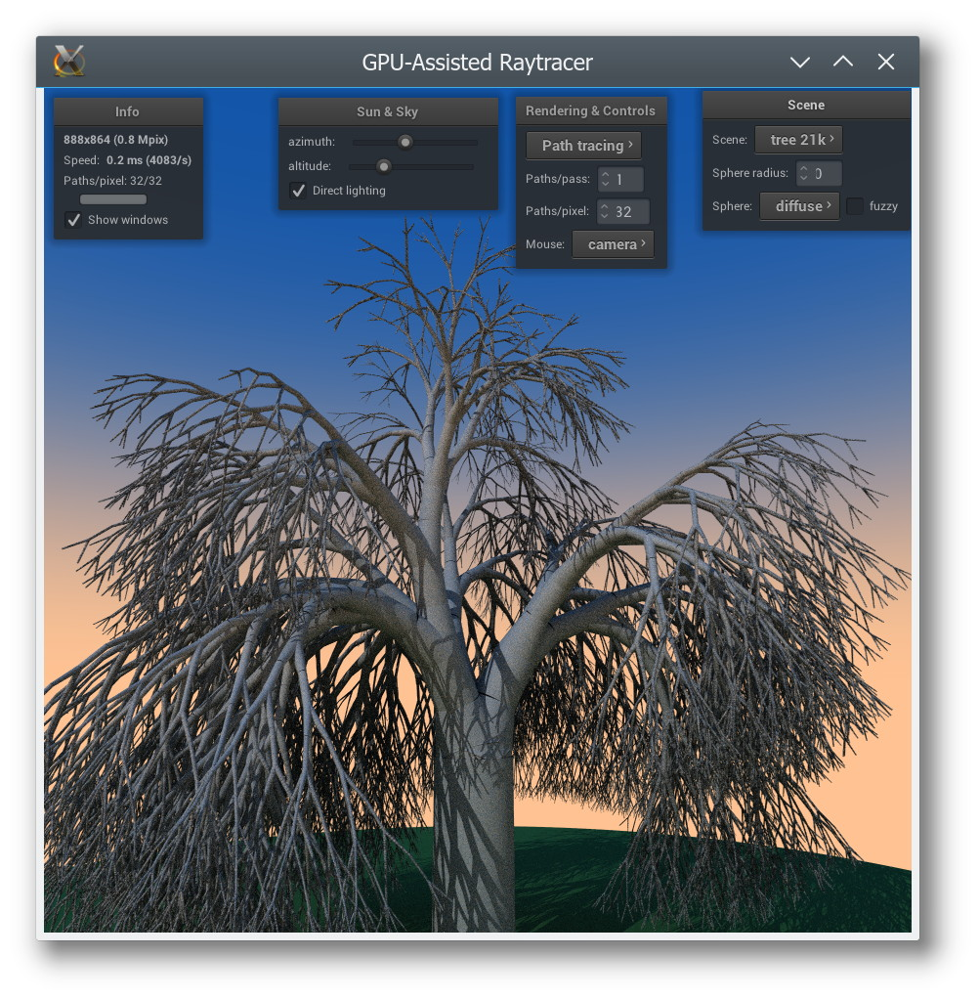

# **GPU-Assisted Ray Tracer**

Copyright (C) 2016 Filip Szczerek (ga.software@yahoo.com)

version 0.1 (2016-12-22)

*This program comes with ABSOLUTELY NO WARRANTY. This is free software, licensed under GNU General Public License v3 or any later version and you are welcome to redistribute it under certain conditions. See the LICENSE file for details.*


## Introduction

**Gpuart** implements real-time ray & path tracing on the GPU as a set of GLSL (version 3.30) shaders, and features:

  - direct lighting
  - Lambertian and specular reflection
  - path tracing, including non-point light sources and glossy specular reflection
  - primitives: triangle, sphere, disc, conical frustum

**Demonstration video:** https://www.youtube.com/watch?v=2lAmO1Ghtn0



The rendered scene’s primitives are stored in a Bounding Volumes Hierarchy (using axis-aligned bounding boxes), which is traversed iteratively & stacklessly in a shader. The BVH is constructed on the CPU and uploaded as a buffer texture.

If you are looking for examples of OpenGL features’ usage, **gpuart** utilizes the following:

  - Vertex Arrays
  - Vertex Buffer Objects
  - Framebuffer Objects
  - buffer textures
  - vertex & fragment shaders
  - rendering to multiple textures from a fragment shader


## Running under Windows

Windows executables can be downloaded from: https://github.com/GreatAttractor/gpuart/releases

To run, they require Visual Studio 2015 Runtime (32-bit), available from Microsoft’s website.


## User interface

- mouse drag with left button down: change camera direction

    Dragging with right or middle button moves either the camera or the user-controlled sphere, depending on the `Mouse` setting in the `Rendering & Controls` window.

- mouse drag with right button down: move camera/sphere in the plane perpendicular to the camera’s “up” vector
- mouse drag with middle button down: move camera/sphere in the plane perpendicular to the viewing direction


## Requirements

OpenGL 3 support (with GLSL 3.30) is required. Building from source code requires a C++11 compiler (tested with GCC 5.3.1 under Linux and Visual Studio Community 2015 under MS Windows). **Gpuart** uses the NanoGUI library for its user interface; it is specified as a Git submodule, so it is checked out automatically from its repository along with **gpuart**.


## Compatibility

Tested on the following hardware/OS/driver combinations:


- Fedora 23 x86-64, Core i5-5200U

    - GL version: `3.3 (Core Profile) Mesa 11.1.0 (git-525f3c2)`
    - GL renderer: `Mesa DRI Intel(R) HD Graphics 5500 (Broadwell GT2)`

- Windows 8.1 x64, Core i5-5200U

    - GL version: `3.3.0 - Build 20.19.15.4501`
    - GL renderer: `Intel(R) HD Graphics 5500`
    
- Fedora 23 x86-64, Radeon R370

    - GL version: `4.1 (Core Profile) Mesa 11.1.0 (git-525f3c2)`
    - GL renderer: `Gallium 0.4 on AMD PITCAIRN (DRM 2.45.0, LLVM 3.7.0)`
    
- Windows 8.1 x64, Radeon R370

    - GL version: `3.3.14009 Core Profile Forward-Compatible Context 21.19.151.3`
    - GL renderer: `AMD Radeon (TM) R7 370 Series`
    

## Building from source code

Prerequisites: Git, CMake.


### Common steps

Clone the source tree:

```
git clone --recurse-submodules https://github.com/GreatAttractor/gpuart
```

Unpack `data.zip`.


### Linux and alikes

Navigate to the `gpuart` folder and run:

```
cmake -G "Unix Makefiles"
make
```

This produces a `gpuart` executable in the source folder.


### MS Windows

As of NanoGUI commit `c03345`, NanoGUI does not build under Windows with MSYS (GCC 6.2), but 32-/64-bit Visual Studio 2015 works fine. You can download the VS 2015 Community Edition from MS website. After installing, you don’t have to start the IDE and go through registration; the command line tools are sufficient. Open the console and set up the environment, e.g., run (with the double quotes):

```
"C:\Program Files (x86)\Microsoft Visual Studio 14.0\VC\bin\vcvars32.bat"
```

or for the 64-bit toolchain:

```
"C:\Program Files (x86)\Microsoft Visual Studio 14.0\VC\bin\amd64\vcvars64.bat"
```

Then navigate to the `gpuart` source folder and run:

```
cmake -G "NMake Makefiles"
nmake
```

This produces `gpuart.exe` in the source folder. Before running it, copy `ext/nanogui/nanogui.dll` to the same location as `gpuart.exe`.


## Miscellaneous

Dragon dataset courtesy of Stanford University Computer Graphics Laboratory.

When the user-controlled sphere is emissive, path tracing does not sample it for direct lighting on every step as it should. Only paths that end up hitting the sphere return its radiance. In other words, currently the solution is incomplete, but still gives visually nice results.

When you modify shaders, be aware that unused `uniform`s will likely be optimized out by the shader compiler; this will cause `gpuart::GL::Program` constructor to fail (it verifies that the expected `uniform`s exist).